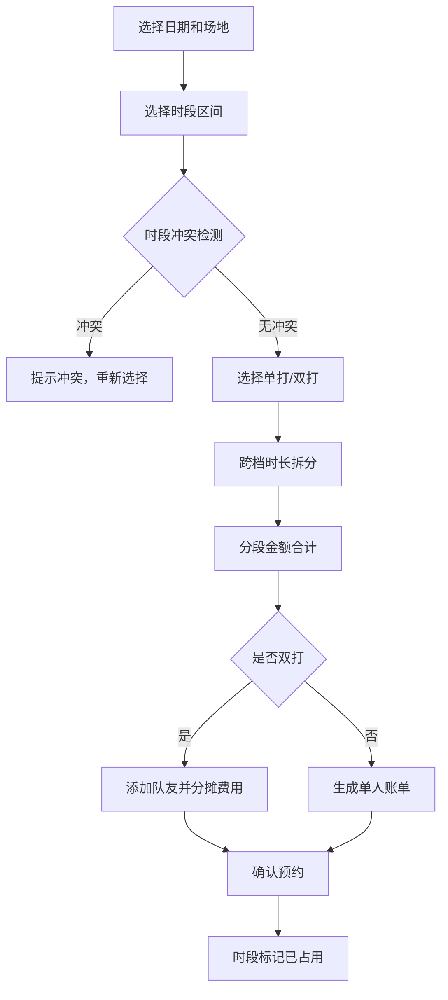

## 1. 产品概述

网球场地预约管理系统是一个纯前端 Web 应用，面向网球场馆运营人员和会员用户，提供网球场建档、时段预约、冲突校验、分段计费、双打组队和账单生成等完整功能。系统解决了人工排期混乱、时段重复预订、计费不透明等痛点，提升场馆运营效率。

## 2. 核心功能

### 2.1 用户角色
本系统为纯前端演示项目，不涉及多用户账号登录，角色体现在操作场景上。

| 角色 | 操作场景 | 核心权限 |
|------|----------|----------|
| 场馆管理员 | 维护基础数据、查看全局排期 | 场地建档、费率维护、所有预约管理、账单查询 |
| 会员用户 | 预约场地、退订、查看账单 | 场地预约、退订、双打组队、查看个人账单 |

### 2.2 功能模块
1. **场地排期模块**：网球场建档、日视图排期展示、预约状态可视化
2. **冲突校验模块**：时段重叠检测、冲突提示、退订时段释放
3. **时段计费模块**：费率表维护、跨费率档时长拆分、分段金额合计
4. **账单生成模块**：预约账单明细、双打费用分摊、账单导出

### 2.3 页面详情
| 页面名称 | 模块名称 | 功能描述 |
|----------|----------|----------|
| 首页/排期总览 | 场地日历排期 | 按日期展示所有场地的时段预约状态，支持日期切换 |
| 预约面板 | 场地预约 | 选择场地、时段、单打/双打，提交预约并自动计算费用 |
| 场地管理 | 网球场建档 | 新增、编辑、停用网球场，配置场地名称、类型、编号 |
| 费率管理 | 时段费率表 | 维护高峰/平峰/谷峰费率，配置时段区间和对应单价 |
| 双打组队 | 双打拼场组队 | 为双打预约添加队友，查看费用分摊明细 |
| 账单中心 | 账单生成 | 查询预约账单明细，展示分段计费过程，支持账单打印 |

## 3. 核心流程

### 预约主流程
用户选择日期和场地 → 点击可用时段 → 选择单打/双打 → 系统检测时段冲突 → 无冲突则按费率表分段计算费用 → 确认预约并生成账单 → 时段标记为已占用。

### 退订流程
用户进入已预约记录 → 选择退订 → 系统释放该时段 → 场地排期重新开放该时段。

### 双打组队流程
创建双打预约 → 添加队友（最多3人）→ 系统自动按人头分摊费用 → 生成个人账单明细。

## 4. 用户界面设计

### 4.1 设计风格
- **主色调**：网球主题的森林绿（#1B5E20）作为主色，网球黄（#FDD835）作为强调色
- **辅助色**：浅灰绿背景（#F1F8E9）、深灰文字（#37474F）
- **按钮风格**：圆角中等（8px），悬浮有微动效和阴影
- **字体**：标题使用具有运动感的几何字体，正文使用现代无衬线字体
- **布局风格**：左侧导航 + 右侧内容区，卡片式布局，清晰的视觉层级
- **图标风格**：使用 Lucide 线性图标，配合网球主题 emoji 🎾

### 4.2 页面设计概述
| 页面名称 | 模块名称 | UI 元素 |
|----------|----------|----------|
| 排期总览 | 场地时间网格 | 时间轴（6:00-22:00，30分钟粒度）、场地列、占用色块（绿色已预约、黄色可预约、灰色停用） |
| 预约弹窗 | 预约表单 | 时段选择器、单打/双打切换、队友添加、费用实时预览、确认按钮 |
| 场地管理 | 场地卡片列表 | 场地名称标签、类型图标（硬地/红土/草地）、启用/停用开关、编辑操作 |
| 费率管理 | 时段费率表 | 可编辑表格、费率档位（高峰/平峰/谷峰）、时段区间输入、单价输入 |
| 账单中心 | 账单列表卡片 | 账单编号、场地信息、时段、费用明细、分段计费展开、打印按钮 |

### 4.3 响应式
采用桌面优先设计，主内容区固定宽度居中显示。在平板和手机端自适应为单列布局，时间网格支持横向滚动。触摸目标最小 44px。
