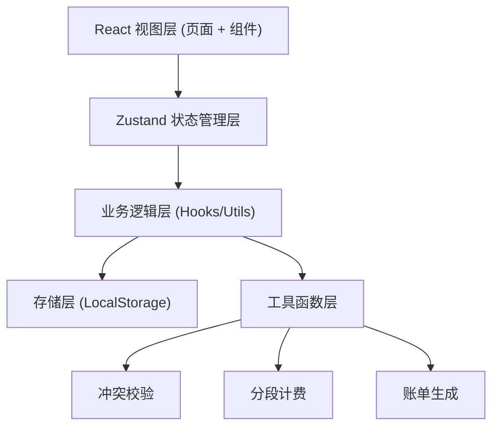
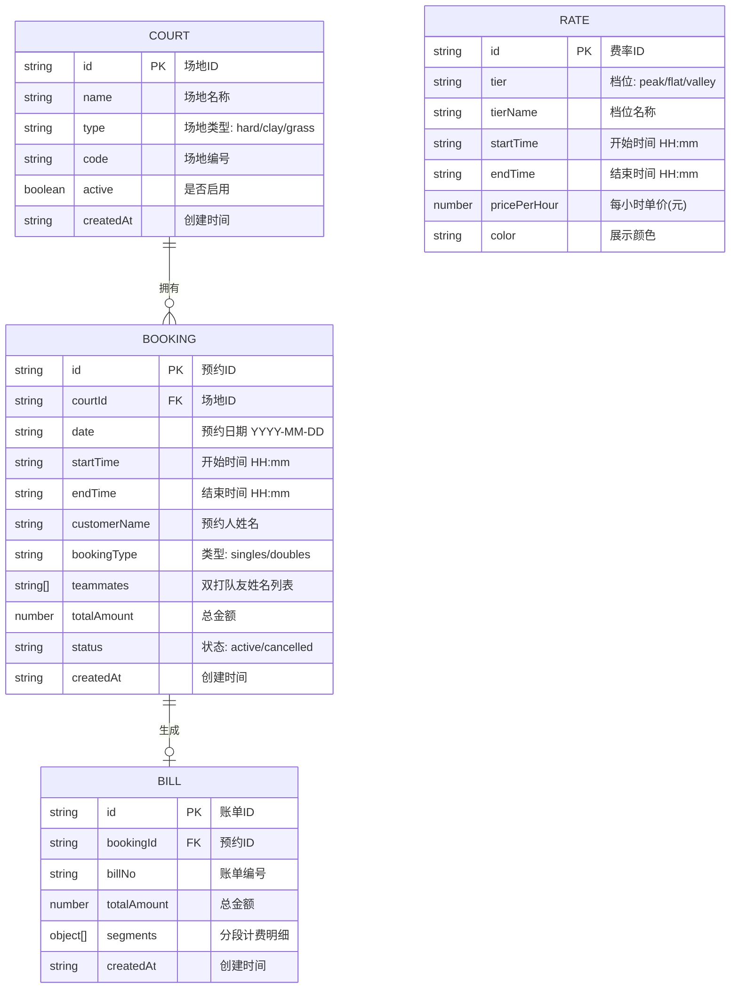

## 1. 架构设计

本系统为纯前端单页应用，所有数据持久化使用浏览器 LocalStorage，无后端服务。

## 2. 技术描述

- **前端框架**: React 18 + TypeScript
- **构建工具**: Vite
- **状态管理**: Zustand
- **样式方案**: Tailwind CSS 3
- **路由**: React Router DOM
- **图标库**: Lucide React
- **数据持久化**: LocalStorage (自定义封装)
- **后端**: 无（纯前端应用）
- **数据库**: 无（使用 LocalStorage 模拟）

## 3. 路由定义

| 路由 | 页面名称 | 用途 |
|------|----------|------|
| / | 排期总览 | 场地日历排期主页面，查看和创建预约 |
| /courts | 场地管理 | 网球场建档与维护 |
| /rates | 费率管理 | 时段费率表维护 |
| /bills | 账单中心 | 预约账单查询与打印 |

## 4. 数据模型

### 4.1 数据模型定义

### 4.2 初始 Mock 数据

系统首次加载时，将初始化以下演示数据：
- 3 片网球场（硬地、红土、草地各 1 片）
- 3 档费率（高峰 18:00-22:00 ¥120/h、平峰 12:00-18:00 ¥80/h、谷峰 06:00-12:00 ¥50/h）
- 若干示例预约记录

## 5. 核心业务模块说明

### 5.1 冲突校验模块
- 输入：courtId, date, startTime, endTime, excludeBookingId?
- 逻辑：遍历当日该场地所有 active 状态预约，检测新区间与已有区间是否重叠
- 重叠判定：`(newStart < existingEnd) && (newEnd > existingStart)`
- 输出：{ hasConflict: boolean, conflictingBookings: Booking[] }

### 5.2 时段计费模块
- 输入：startTime, endTime
- 步骤：
  1. 将预约时段按费率切换点拆分为多个子时段
  2. 每个子时段匹配对应费率档位
  3. 按子时长 × 对应单价计算各段金额
  4. 合计所有分段金额得到总金额
- 输出：{ segments: Segment[], totalAmount: number }

### 5.3 双打费用分摊
- 双打预约总金额按人数（预约人 + 队友）平均分摊
- 向上取整到元，余数归到预约人账上
